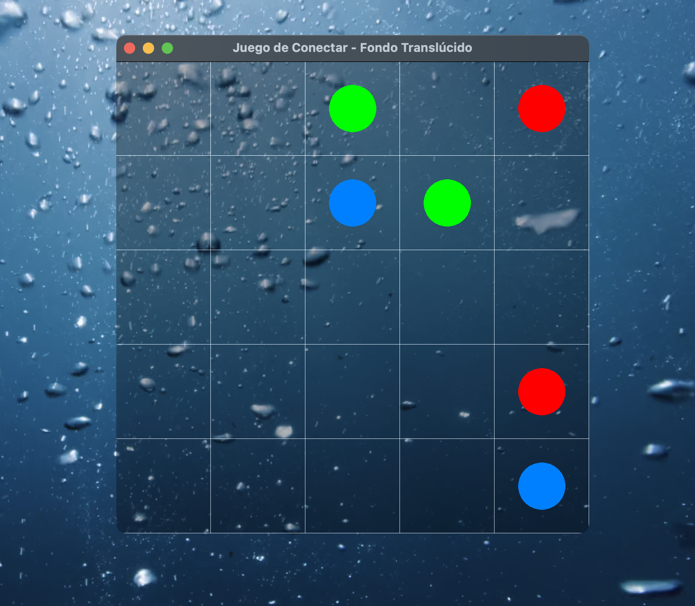

# Juego de Conectar Círculos

Este proyecto es un juego de conectar círculos en una cuadrícula 5x5, implementado en C++ utilizando GLFW y OpenGL. El juego permite:
- Dibujar líneas entre pares de círculos de colores (sin repetir colores).
- Guardar, cargar y resetear el tablero.
- Mostrar un fondo de ventana translúcido (si el hardware/driver lo soporta).

---

## Requisitos

- **Sistema Operativo:**
  - Windows 11
  - macOS (Sequoia o superior)
  - Linux (Distribuciones compatibles)

- **Compilador:**
  - **Windows:**  
    - Visual Studio 2022 (o versión compatible)  
    - O MinGW-w64/Cygwin con gcc  
  - **macOS:** clang++ (se recomienda usar Xcode Command Line Tools)
  - **Linux:** gcc/clang con soporte para C++17

- **Librerías y Dependencias:**
  - [GLFW](https://www.glfw.org/) – Descarga la versión precompilada o compílala desde fuente.
  - **OpenGL:**  
    - Windows: `opengl32.lib` (incluido en el sistema)  
    - macOS: Framework OpenGL  
    - Linux: Paquetes de OpenGL (p.ej., `mesa`, `libGL-devel`)
  - Otros (según el sistema):
    - Windows: Configuración de drivers gráficos actualizados.
    - macOS: Xcode y SDKs correspondientes.
    - Linux: Paquetes de desarrollo para X11 (como `libX11-devel`, `libXi-devel`).

---

## Instrucciones de Compilación y Ejecución

### Windows 11

#### Opción 1: Usando Visual Studio

1. **Descargar GLFW para Windows:**
   - Descarga la versión precompilada desde [glfw.org/download.html](https://www.glfw.org/download.html).
   - Extrae los archivos y coloca la carpeta `include` y las librerías (`glfw3.lib` y/o `glfw3dll.lib`) en rutas accesibles.

2. **Configurar el proyecto en Visual Studio:**
   - Crea un nuevo proyecto de "Aplicación de consola" en C++ y agrega `main.cpp`.
   - En **Propiedades del proyecto → C/C++ → General**, agrega la ruta de los headers de GLFW (por ejemplo, `C:\path\to\glfw\include`).
   - En **Linker → General**, agrega la ruta a las librerías (por ejemplo, `C:\path\to\glfw\lib`).
   - En **Linker → Input**, agrega `glfw3.lib` y `opengl32.lib`.
   - Configura el estándar de C++ a C++17.
   - Compila y ejecuta el proyecto.

3. **Fondo Translúcido:**
   - El código solicita un framebuffer transparente usando:
     ```cpp
     glfwWindowHint(GLFW_TRANSPARENT_FRAMEBUFFER, GLFW_TRUE);
     glfwWindowHint(GLFW_ALPHA_BITS, 8);
     glClearColor(0.0f, 0.0f, 0.0f, 0.3f);
     ```
   - Nota: La transparencia dependerá del soporte del hardware y los controladores.

#### Opción 2: Usando MinGW o Cygwin

1. **Instalar MinGW-w64 o Cygwin:**
   - Instala la herramienta de compilación deseada.  
   - En Cygwin, asegúrate de instalar también los paquetes de desarrollo para X11 y OpenGL.

2. **Instalar GLFW:**
   - Puedes descargar la versión precompilada para MinGW o compilar GLFW desde fuente en Cygwin:
     ```bash
     mkdir build && cd build
     cmake .. -G "Unix Makefiles" -DGLFW_BUILD_WAYLAND=OFF -DGLFW_BUILD_X11=ON
     make
     make install  # Opcional, instala en /usr/local/
     ```
3. **Compilar el código:**
   - En una terminal, navega al directorio del proyecto y ejecuta:
     ```bash
     g++ -std=c++17 main.cpp -o juego -I/usr/local/include -L/usr/local/lib -lglfw3 -lGL -lX11 -lpthread -lm -ldl
     ```
4. **Ejecución en Cygwin:**
   - Inicia el servidor X con `startxwin` y asegúrate de que la variable `DISPLAY` esté configurada (o abre un xterm dentro del entorno X).
   - Ejecuta tu programa:
     ```bash
     ./juego
     ```

---

### macOS

#### Compilación en macOS (Sequoia)

1. **Instalar GLFW para macOS:**
   - Puedes descargar la versión precompilada de GLFW o compilar desde fuente.
   - Si usas Homebrew, puedes instalar GLFW con:
     ```bash
     brew install glfw
     ```
   - Asegúrate de que los headers y la biblioteca se encuentren en rutas estándar (por ejemplo, `/usr/local/include` y `/usr/local/lib`).

2. **Compilar el código:**
   - Abre una terminal en macOS y navega al directorio del proyecto.
   - Ejecuta el siguiente comando:
     ```bash
     clang++ -std=c++11 -stdlib=libc++ \
       -DGL_SILENCE_DEPRECATION \
       -I/usr/local/include \
       -I$(xcrun --show-sdk-path)/usr/include/c++/v1 \
       -isysroot $(xcrun --show-sdk-path) \
       main.cpp -o juego -L/usr/local/lib -lglfw -framework OpenGL
     ```
   - Nota: El ejemplo usa C++11; si deseas usar C++17, cambia `-std=c++11` por `-std=c++17`.

3. **Ejecución:**
   - Ejecuta el binario con:
     ```bash
     ./juego
     ```

4. **Fondo Translúcido:**
   - El código utiliza:
     ```cpp
     glfwWindowHint(GLFW_TRANSPARENT_FRAMEBUFFER, GLFW_TRUE);
     glfwWindowHint(GLFW_ALPHA_BITS, 8);
     glClearColor(0.0f, 0.0f, 0.0f, 0.3f);
     ```
   - Asegúrate de que tu sistema y drivers soporten la transparencia en ventanas.

---

### Linux

1. **Instalar Dependencias:**
   - Instala los paquetes de desarrollo para OpenGL, X11 y GLFW. En distribuciones basadas en Debian/Ubuntu:
     ```bash
     sudo apt-get install libglfw3-dev libgl1-mesa-dev libx11-dev libxi-dev build-essential
     ```
2. **Compilar el código:**
   - En una terminal, ejecuta:
     ```bash
     g++ -std=c++17 main.cpp -o juego -lglfw -lGL -lX11 -lpthread -lm -ldl
     ```
3. **Ejecutar:**
   - Simplemente ejecuta:
     ```bash
     ./juego
     ```

---

## Funcionalidades del Juego

- **Dibujo de Líneas:**  
  - Al hacer clic en un círculo, se inicia la conexión. Arrastra el mouse para unir celdas adyacentes (horizontal o vertical).  
  - Suelta el botón sobre otro círculo del mismo color para confirmar la conexión.  
  - Si la conexión no se completa correctamente, la línea se descarta.

- **Guardar y Cargar Tablero:**  
  - Presiona **S** para guardar el estado actual en `miTablero.txt`.  
  - Presiona **L** para cargar el tablero desde `miTablero.txt`.

- **Resetear Tablero:**  
  - Presiona **R** para generar un nuevo tablero aleatorio (cada color se utiliza solo una vez, formando pares).

- **Fondo Translúcido:**  
  - Se utiliza `GLFW_TRANSPARENT_FRAMEBUFFER` y `glClearColor` con canal alfa para lograr un fondo con 30% de opacidad.  
  - La efectividad depende del soporte del sistema y de los drivers.

---

## Problemas Comunes

- **Error al Inicializar GLFW:**  
  - En entornos Linux/Cygwin, asegúrate de tener un servidor X en ejecución y la variable `DISPLAY` configurada.
- **Transparencia no Visible:**  
  - La transparencia depende del hardware y drivers. En Windows, prueba actualizar tus drivers o utiliza otra versión de GLFW si es necesario.
- **Dependencias y Rutas:**  
  - Verifica que las rutas de los headers y bibliotecas estén correctamente configuradas para tu sistema.

---

## Referencias

- [GLFW Documentation](https://www.glfw.org/docs/latest/)
- [OpenGL Reference](https://www.opengl.org/)
- [Visual Studio](https://visualstudio.microsoft.com/)
- [MinGW-w64](https://mingw-w64.org/)
- [Cygwin](https://www.cygwin.com/)
- [Homebrew](https://brew.sh/) (macOS)

---

Con estas instrucciones, deberías poder compilar y ejecutar el juego en Windows 11, macOS y Linux. ¡Que disfrutes programando!

